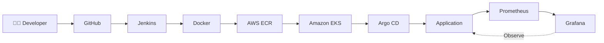
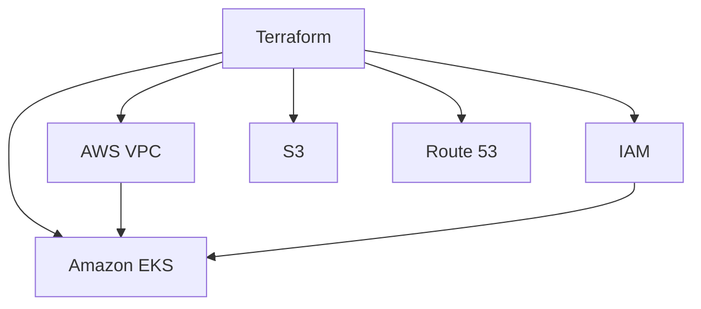
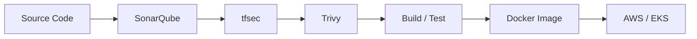

<div align="center">

# 👋 Hi, I'm Prashanth

### AWS DevOps Engineer | Cloud Infrastructure | Kubernetes | DevSecOps

**Automate → Deploy → Observe → Secure**

Building reliable and scalable cloud infrastructure through
automation, Infrastructure as Code and continuous delivery.


</div>

---

## 👨‍💻 About Me

I'm an **AWS DevOps Engineer with 4+ years of experience** working on
cloud infrastructure, CI/CD automation, containerization and DevSecOps.

My primary focus is building and maintaining reliable infrastructure
using **AWS, Terraform, Docker and Kubernetes**, while improving
software delivery through **Jenkins, GitHub Actions and GitOps practices**.

I enjoy troubleshooting real-world infrastructure problems,
automating repetitive tasks, and continuously improving deployment
and monitoring workflows.

---

## ⚙️ Engineering Stack

| Area | Technologies |
|---|---|
| ☁️ **Cloud** | AWS, EC2, VPC, IAM, S3, ALB/ELB, Auto Scaling, RDS, EKS, Fargate, CloudWatch |
| 🏗️ **Infrastructure** | Terraform, Terraform Modules, Ansible |
| 🐧 **Systems** | Linux, Bash |
| 🐳 **Containers** | Docker, Kubernetes, Amazon EKS |
| 🔄 **CI/CD** | Jenkins, GitHub Actions, Maven |
| 🔁 **GitOps** | Argo CD |
| 🔐 **DevSecOps** | SonarQube, Trivy, tfsec |
| 📊 **Monitoring** | Prometheus, Grafana, CloudWatch, Datadog |
| ⛵ **Packaging** | Helm |
| 🔧 **Version Control** | Git |

---

# 🚀 DevOps Architecture



### 🔄 Delivery Flow

**Code → Build → Containerize → Store → Deploy → Observe → Improve**

---

# 🏗️ Infrastructure as Code

I use **Terraform** to provision and maintain AWS infrastructure in a
repeatable and version-controlled way.



### Infrastructure Principles

> **Repeatable → Automated → Version Controlled → Consistent → Observable → Secure**

---

# 🔐 DevSecOps

Security should be integrated into the delivery lifecycle rather than
treated as a final step.



### Security Tooling

- **SonarQube** — code quality and static analysis
- **Trivy** — container and dependency vulnerability scanning
- **tfsec** — Terraform security analysis

---

# 🧠 Troubleshooting Mindset

When something breaks, I prefer understanding the failure before
changing the configuration.

```text
Problem
   ↓
Identify the failing layer
   ↓
Logs / Metrics / Events
   ↓
Validate Configuration
   ↓
Check Resources / Network
   ↓
Apply the smallest safe change
   ↓
Validate Result
   ↓
Document Root Cause
```

### Areas I Work With

- Linux systems
- CI/CD pipelines
- Kubernetes workloads
- Docker containers
- AWS infrastructure
- Networking
- Application availability
- Monitoring and alerts

---

# 📦 Featured DevOps Labs

> Practical projects focused on infrastructure, automation,
> deployment and observability.

### ☁️ AWS EKS + Terraform

**Infrastructure as Code**

```text
Terraform
    ↓
AWS VPC
    ↓
IAM
    ↓
EKS
    ↓
Kubernetes Workloads
```

**Focus:** AWS infrastructure, Terraform modules, networking,
IAM and Kubernetes infrastructure.

---

### 🔨 Jenkins + Docker CI/CD

**Automated application delivery**

```text
GitHub
   ↓
Jenkins
   ↓
Build / Test
   ↓
Docker
   ↓
Container Registry
```

**Focus:** Jenkins pipelines, Maven builds, Docker and CI/CD
automation.

---

### ☸️ Kubernetes + GitOps

**Application delivery using GitOps practices**

```text
Git Repository
      ↓
   Argo CD
      ↓
 Kubernetes
      ↓
 Application
```

**Focus:** Kubernetes, EKS, Argo CD and Helm fundamentals.

---

### 📈 Kubernetes Monitoring

**Container and infrastructure observability**

```text
Kubernetes
     ↓
Prometheus
     ↓
Grafana
     ↓
Dashboards / Metrics / Alerts
```

**Focus:** Prometheus, Grafana, Kubernetes metrics and
troubleshooting.

---

# 📚 Currently Learning

- ☸️ Advanced Kubernetes
- ☁️ AWS Cloud Architecture
- 🏗️ Platform Engineering
- 🔐 DevSecOps Automation
- 🤖 AI-assisted DevOps

---

# 🎯 Engineering Principles

> **Infrastructure should be reproducible.**

> **Deployments should be automated.**

> **Configuration should be version controlled.**

> **Failures should be observable.**

> **Security should be integrated.**

> **Automation should reduce repetitive work.**

> **Documentation should explain WHY, not only HOW.**

---

# 📊 GitHub Activity

<div align="center">


</div>

---

# 🤝 Let's Connect

<div align="center">

### Cloud • DevOps • Kubernetes • Terraform • DevSecOps

I'm always interested in learning, building and discussing
cloud infrastructure and DevOps engineering.

[](https://www.linkedin.com/in/prashanth-bhaskari)

[](https://github.com/Prashanth3004)

</div>

---

<div align="center">

### `AUTOMATE • DEPLOY • OBSERVE • SECURE`

**Thanks for visiting my profile 👋**

</div>
